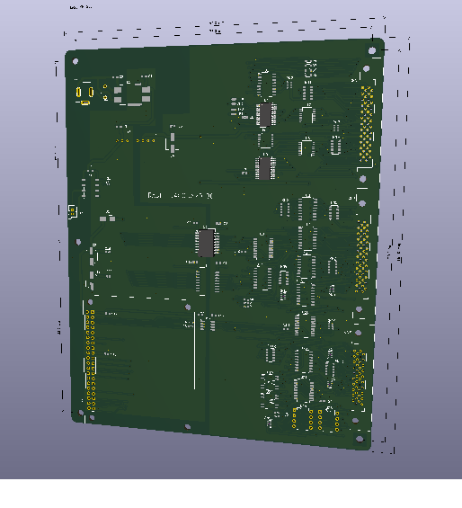
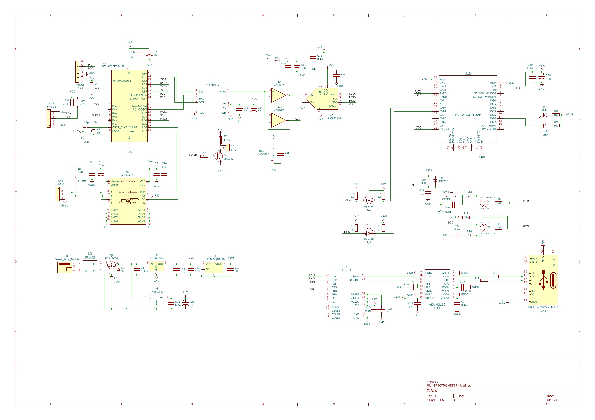
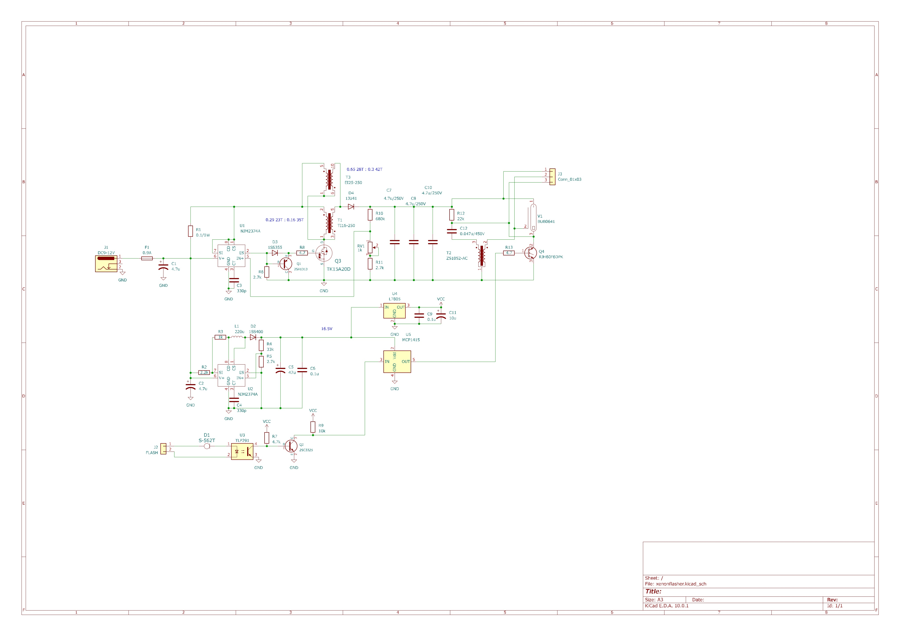

+++
date = '2026-06-03T05:58:19+09:00'
draft = false
title = 'ポスト260603'
+++

# 無線と生産設備

生産現場のノイズ環境は様々で、ブラシモーターやインダクションモーターはたまた放電溶接現場まであります。  
その中でWIFIやBluetoothで設備間通信を行うリスクは大きくなります。  
インダクションモーターがジャカードを回転駆動する中でICEやロジックアナライザーを使おうとして，まったく使えなかった事もあります。  
最悪USBメモリまで使えなかったのですからそれは恐ろしいものがあります。  
例えば、放電加工機そのものを設計するのは、シールドと、基板パターンや配線のノイズ脆弱性を考慮すればよいのですが、システムとなると難しい物があります。  
また、WIFIやBLEも切断というトラブルがあり、keep aliveでは解決できない現場が大抵です。  
BLEでは、アドバタイズからやらないで、PCペアリングステータスをGet、そのCharacteristicを使い、翌朝には繋がらないとクレームの荒らしに会ったこともあります。  
とかく、無線の取り扱いは、生産現場では難しい。  
生産現場のライン形成は、有線でしか安全性、安定性を担保できないというのが実感です。　

# ラズパイ版ジャカードコントローラー

ラズパイを使用するジャカードコントローラー基板が届きました。  
ESP32-S3版で遊んでいましたが、速達、ラズパイでも実験してみようと思います。  
ラズパイでPythonがどれほど開発が楽なのか確かめてみます。  
  

# GitHubコパイロット新課金制度開始

一定使用料超えた分の課金制度が開始しました。  
AIコパイロットは特にRustを使う上での助っ人役なので、スタートして安堵しました。  
速達、問題Fixしてもらいましたw  
月々の支払いがどのぐらいになるか興味津々です。  

# HUGO Page Bundle

イメージ管理の簡略化でPage Bundleスタイルに変更しました。  
static管理ではなく、ポストフォルダーに画像を同梱する機能です。  

# 設備関係の標準化意識の希薄さ

生産関係もたまにはありますが、設備関係者はおおむね、標準化意識が低いのが常と感じます。  
ガス警報盤などは、案件ごとにPLCやらMPUやらラズパイやら・・・w  
仕事をやっつけてしまえば良いという気質の人が多く閉口したことが多々。  
ファシリティー関係の仕事をしているとそうなるというのはわかりますが、かなり危険です。  
ICカードの入退出管理を、R&Dクリーンルーム毎に手作り別仕様というのを目撃した時は、こりゃダメだと思いました。    
プロトモデル標準を確立するという気がない関係者が多い昨今は、それを構築したスキルある人が退職すると目も当てられない惨状になるのは想像に難くありません。  

# マイクロ分光器

マイクロ分光器を手に入れました。  
[マイクロ分光器](https://akizukidenshi.com/catalog/g/g112673/)  
可視光領域だけですが、染色のレサイプ評価、カラーマッチングなどに使えればと購入しました。  
グルーコースの磁気+光旋回性から量を測定できればという野心もあります。  
いわゆる、非侵襲血糖値測定ですね。  
紫外線モジュールも秋月で売ってくれれば最高なんですが・・・  
測定基板も在り、PICマイコンのCLCをフル活用したサンプリングはできています。  
  
  
既に3Dプリンターで磁気ドライブの構造も作っていますので、UVランプフラッシャーと磁気ジェネレーターでどんな反応をグルコースがしてくれるのか楽しみです。  
昨今のFreeCADの進化は素晴らしい。  

