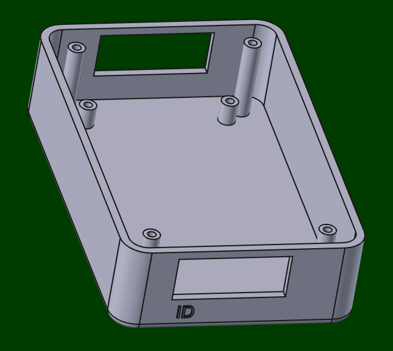
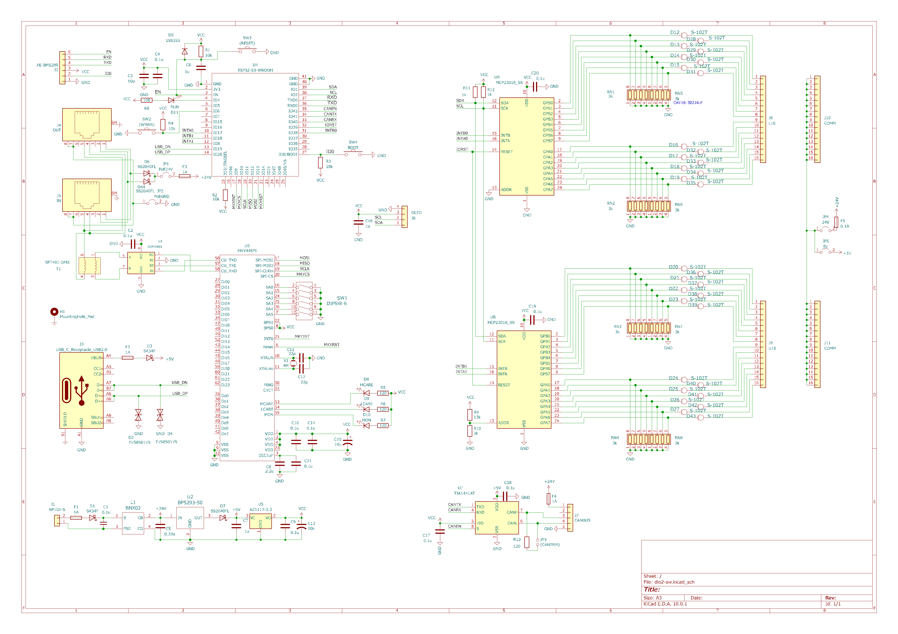
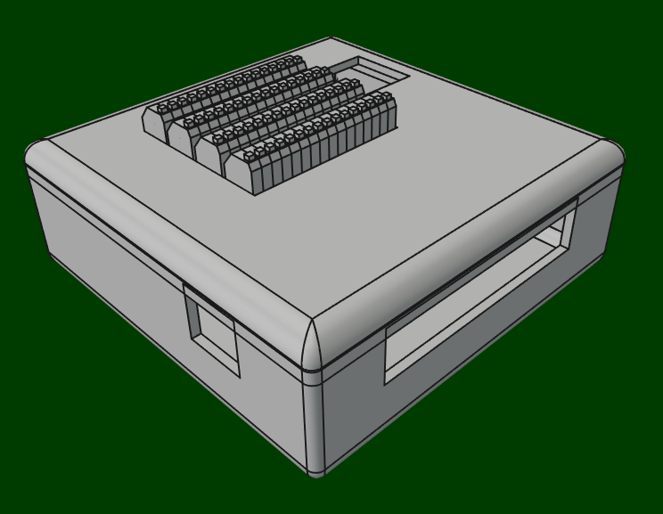

+++
date = '2026-06-04T04:52:58+09:00'
draft = false
title = 'ポスト260604'
+++


# MIO基板仲間たち

MIOシステムのメンバーです。  
アナログ入出力のCAN基板以外は32ビット入出力です。  
今後も逐次増やしていきます。  
  
  
  
  
  
  
  
 

# MIOセンター紹介

まずは回路図。

ESP32-S3ベースのMKY44SPIと接続するシンプルな回路です。  
簡易なPoEとしていますが、500mA程度がMAXです。  
ESP32なので、USBだけでなく、WIFIとBluetoothで上位マシンと接続できます。  


ファームウェアの構成は今のところ以下の構造としています。  

```text
├─App
├─Domain
│  ├─Helpers
│  │      jsonhelper.h
│  │      stringhelper.h
│  │      systemhelper.h
│  │
│  ├─Models
│  │      devtype.h
│  │      inmapinfo.h
│  │      mapattr.h
│  │      outmapinfo.h
│  │      palmode.h
│  │      wifiinfo.h
│  │
│  ├─Parsers
│  │      wifiparser.h
│  │
│  ├─Repositories
│  │      iblerepository.h
│  │      idmxrepository.h
│  │      ierrorservicerepository.h
│  │      ifilerepository.h
│  │      imailservicerepository.h
│  │      imapperrepository.h
│  │      imediaterrepository.h
│  │      imkyrepository.h
│  │      iparserepository.h
│  │      iserialrepository.h
│  │      iwificurepository.h
│  │      iwifirepository.h
│  │
│  ├─Services
│  │      errorservice.h
│  │      mailservice.h
│  │      mediaterService.h
│  │
│  └─Shared
│          common.h
│          constant.h
│          errorcode.h
│
└─Infrastructure
    │  factories.h
    │
    ├─Drivers
    │      bledriver.h
    │      filedriver.h
    │      mkydriver.h
    │      serialdriver.h
    │      socketdriver.h
    │      wificucenter.h
    │      wifimanage.h
    │
    ├─Fakes
    │      mkyfake.h
    │
    └─Shared
            config.h
            drivers.h
            timermanager.h

```

苦労したのは、MKYとのSPIアクセスです。  
コンストラクタでの初期化はブートと衝突しないようlazyで行わなければならず、ESPのSPIレジスターをダイレクトに叩いてタイミング調整が必要でした。  

```c++
        _spi = spiStartBus(SPI_NUM, clkdiv, SPI_MODE2, SPI_MSBFIRST);
        _spi->dev->user1.cs_hold_time = 10;  // tCSH
        _spi->dev->user1.cs_setup_time = 10; // tCSS

```

オリジナルのハンドルを再定義し、内部レジスターにアクセスしています。  
アセンブラの方が楽なので、今はアセンブラに修正しています。  
このトリミングが無いと、不安定になります。  
ちなみにRustではこの辺ができるのかesp-idf-halをながめてみましたが、ラッパー&ドロップできる形態では無いようです。  
もちろん、unsafe cコールでできますが、トリミングできるfnは欲しいものです。  


# MIOスイッチ入力

まずは回路。

これもシンプルな回路で、ドライバーと定電流->電圧変換だけです。  

