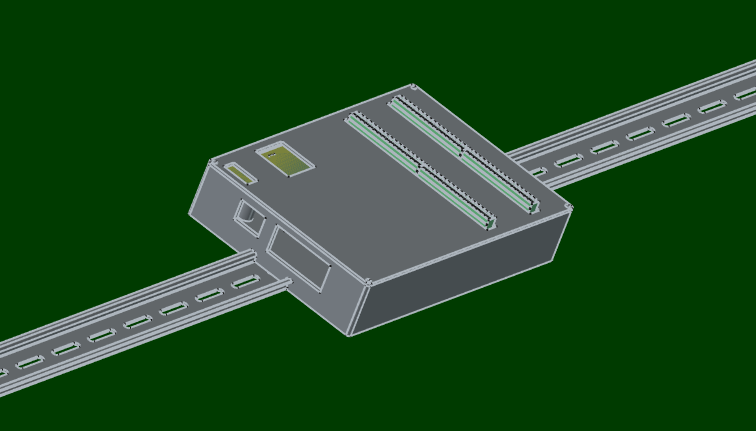

+++
date = '2026-06-05T05:39:58+09:00'
draft = false
title = 'ポスト260605'
+++

# Arduino UNO Q 4GB

> Arduino UNO Q 4GBをポチった。
> 
> さて、何に使うかな。
> 
> 構想段階だが、アスパラガス収穫ロボットに向けてGOだな。  
> 
> RTKでミリ単位座標取得できるようになり、面白い物が作れると思う。
> 
> アスパラガスは、柔らかさを測定するマニュピレーターが命。
> 
> 

# MIOLED出力

# MIOソレノイド出力

# MIOカラーセンサー

# MIO吸引圧センサー

# MIO導通チェッカー

